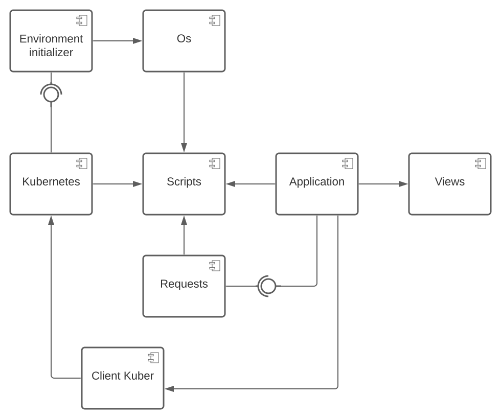

# ConsoleAppStore

# Диаграмма компонентов и их описание

## Os

Обертка для взаимодействия с осью (в данном случае с `Ubuntu`):

> Вызов скриптов для установки;

> Вызов скриптов для удаления;

> Возможно, что вызов каких либо других скриптов.

Запуск всех скриптов осуществляется в интерактивном режиме.

## Scripts

Обертка для работы со скриптами:

> Предоставить место, куда сохранять скрипты;

> Удалить скрипт из хранилища по имени;

> Предоставить список скриптов;

> Получить конкретный скрипт по имени.

## Views

Отвечает за работу с `TUI`. Реализует методы:

> `Init` - для инициалиизации начального отображения;

> `Update` - для обновления отображения в результате действия пользователя;

> `View` - для отображения интерфейса.

## Requests

Отвечает за запросы в `Git`, где хранятся все скрипты:

> `Get` - запрос. Получить все скрипты с их описанием, которые есть в хранилище;

> `Download` - запрос. Загрузить скрипт в локальное хранилище.

## Environment initializer

Отвечает за установку, настройку и удаление `Kubernetes` с машины пользователя.

## Client Kuber

Компонент обеспечивающий взаимодействие с кластером `Kubernetes`.

## Kubernetes

`Kubernetes` содержит развернутые приложение.

## Application

Компонент, в котором содержится вся бизнес-логика приложения.
